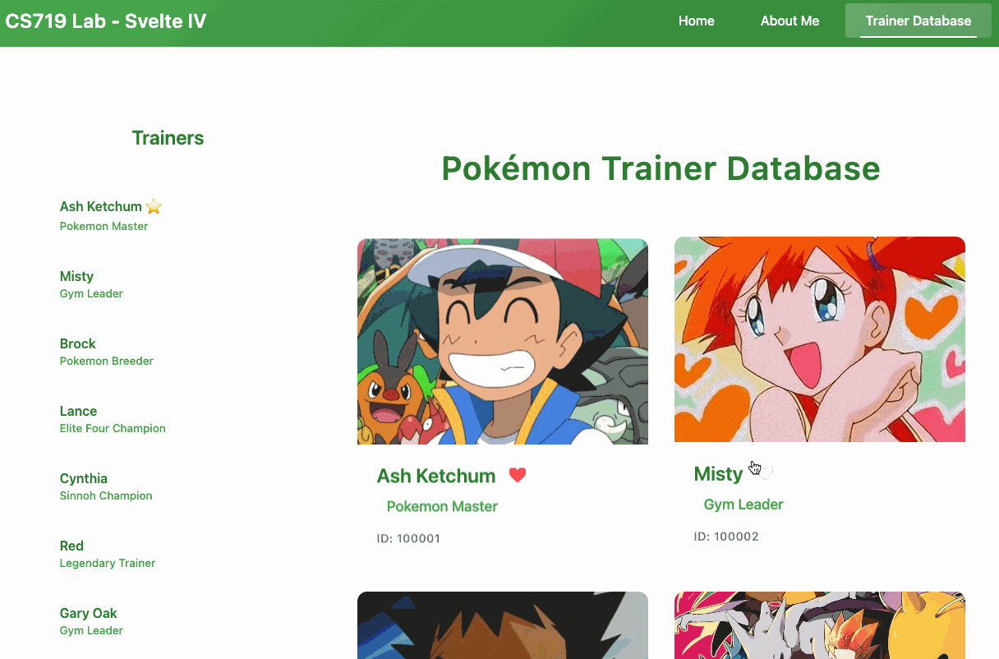

# COMPSCI 719 Lab: Svelte V

In this lab, we'll continue gaining experience with Svelte, along with its recommended framework, SvelteKit. In this lab, we'll look at _another_ way of fetching data from APIs - in `load()` functions inside new `+page.js` and `+layout.js` files.

Before starting, remember to run `npm install` in the root directory (the same one as this README) in order to install this project's dependencies.

## Exercise Zero - Copying the previous lab

For this first exericse, **copy your solution from the previous lab over to this project**. Copy the **`src`** folder over the `src` folder in the project root (i.e. where this README is located). If it asks you to overwite files, please select **Yes**.

Once copied, run the project to make sure everything still works correctly from the previous lab.

**Note:** As an alternative, you are welcome to just keep working in the previous lab's repository, modifying that project. It's up to you! If you do, you might want to consider [creating a new git branch](https://git-scm.com/book/en/v2/Git-Branching-Basic-Branching-and-Merging) so you can go back and forth between the previous lab's solution, and this one.

## Exercise One - SvelteKit data loading

In the previous lab, we were fetching trainer data directly from within Svelte component. Now, we will convert this to use SvelteKit's `load()` function, written within `+layout.js` and `+page.js` files.

### Trainer side panel

First, create a new file called `+layout.js` inside the `routes/trainers` folder. In that file, add the following:

```js
import { PUBLIC_BASE_URL } from "$env/static/public";

export async function load({ fetch }) {
  try {
    const res = await fetch(`${PUBLIC_BASE_URL}/api/trainers`);
    if (!res.ok) return { trainers: [], error: "Failed to fetch trainer data" };
    const trainers = await res.json();
    const data = { trainers };
    return data;
  } catch (error) {
    return { trainers: [], error: error.message };
  }
}
```

This code will fetch the trainer summary data from our `ocean.anhydrous.dev` site, and return it as the `trainers` property of the SvelteKit `data` object. If there are any errors, then `trainers` will instead be set to an empty list, and an `error` message will be set.

This function will be run whenever we load the associated `+layout.svelte` file - In this case, whevnever we navigate to `/trainers` or `/trainers/[trainerId]`.

Next, within `/trainers/+layout.svelte`, add a new prop, called `data`:

```js
let { data } = $props();
```

The contents of this `data` prop will be equal to whatever we have returned from the `load()` function above. Therefore, it should have a `trainers` property and (if we had an error) an `error` property.

Use this `trainers` data to populate your side panel you designed in the previous lab. Delete the previous code you had which called `fetch()` directly from wihtin `+layout.svelte`.

### Trainer summary page

Next, you should _also_ use the same trainers data to populate your main trainer summary page at `/trainers/+page.svelte`. You can have `let { data } = $props()` in that page too, and it will contain the same information, without the need to write another `load()` function. This is because each `load()` function's data is accessible by the page / layout it's defined in, _and any of its children_ (and `/trainers/+page.svelte` is a child of `/trainers/+layout.svelte`).

### Trainer detail / Pokemon team page

Next, create another file called `/trainers/[trainerId]/+page.js`. In here, implement another `load()` function. This time, the function should fetch from `https://pkserve.ocean.anhydrous.dev/trainers/{trainerId}`.

The `trainerId` path parameter can be accessed through the `params` property of the load function's argument, like so:

```js
export async function load({ fetch, params }) {
  // Can use params.trainerId here
}
```

By the end of this exercise, your folder structure inside the `routes` folder will look like so:

```text
routes
  - about
    - +page.svelte    <- "About" page
  - trainers
    - [trainerId]
      - +page.js      <- Loads data for trainer detail page
      - +page.svelte  <- Trainer detail page
    - +layout.js      <- Loads data for trainer sidebar and trainer summary
    - +layout.svelte  <- Trainer sidebar
    - +page.svelte    <- Trainer summary page
  - +layout.js
  - +layout.svelte    <- Contains the Navbar
  - +page.svelte      <- Homepage
```

## Exercise Two - Sharing state between components

Using the `$state()` rune to create reactive state in our components is one of the _core_ principles of Svelte development. We can also put these state runes in _external_ JS files (named with the `*.svelte.js` naming convention), and import them into multiple components at the same time! This way, we can share state between components, and make sure that _all_ components UI's get updated when that state changes!

### Creating the shared state

To begin, create a new file called `favourite-trainer.svelte.js`, inside the `src/lib/js` folder. Inside, create a new reactive variable called `favouriteTrainerStore` like so:

```js
export const favouriteTrainerStore = $state({
  trainerId: null
});
```

This will create a reactive variable. Whenever we modify its `trainerId` property, any Svelte components displaying that property will be updated! We are also using the `export` keyword to allow us to `import` that variable into any other file.

### Setting your favourite trainer

Presumably, you have a Svelte component for displaying a trainer's summery (their name, title, and id). Import into that component like so:

```js
import { favouriteTrainerStore } from "$lib/js/favourite-trainer.svelte.js";
```

Then, give your component a button which does the following:

- When clicked, the button will set `favouriteTrainerStore.trainerId` to the `trainerId` of that trainer.
- That button should have a different style depending on whether that trainer is the current "favourite".
- If the button is clicked when that trainer is already your favorite, `favouriteTrainerStore.trainerId` should be set to `null` instead.

When you complete this subtask, you should notice that when you click a button to "favourite" one trainer, the other trainers' "favourite" buttons will become unselected.

### Getting your favourite trainer

Finally, _read_ the value of `favouriteTrainerStore.trainerId` elsewhere in your app, to make some visual change depending on who the favourite trainer is.

For a simple example, you could display an icon or emoji on the sidebar, next to the favourite trainer, like you can see in the GIF below:



#### Super bonus extension task: Style the _whole app_

As a super bonus extension task for anyone who loves CSS - Imagine a "page theme" for each trainer. And then apply that theme to your whole page, depending on which trainer is "favourited".

A good way to do CSS themes is to store all your colours (and maybe fonts) as [CSS variables](https://developer.mozilla.org/en-US/docs/Web/CSS/CSS_cascading_variables/Using_CSS_custom_properties), which you can override within `routes/+layout.svelte` by surrounding the whole page content with a `<div>` with its `style` property set. For example:

```svelte
<script>
  let myColor = "red";

  let { children } = $props();
</script>

<div style="--color-primary: {myColor}">
  <nav>
    <!-- navbar here -->
  </nav>

  <!-- Rest of the app here -->
  <div class="container">
    {@render children()}
  </div>
</div>
```
